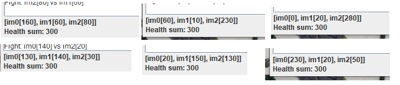
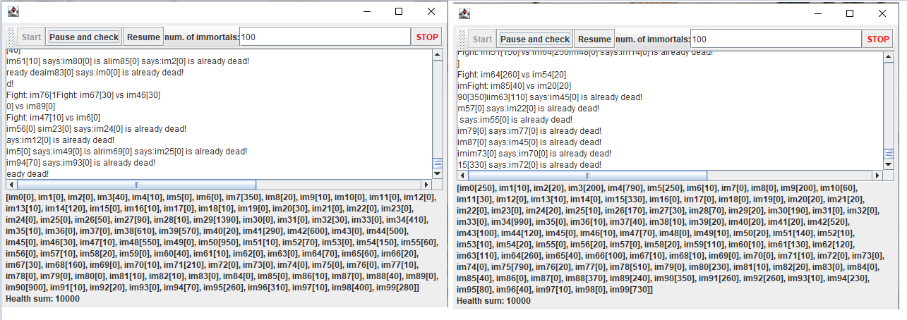
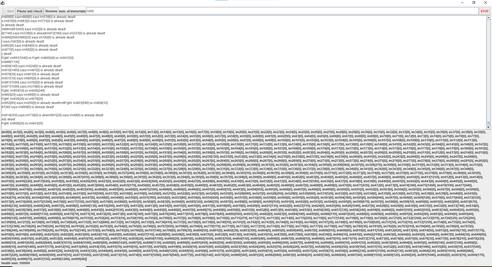
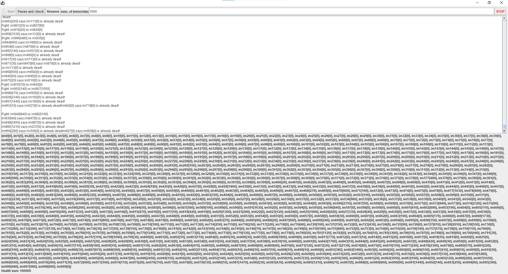
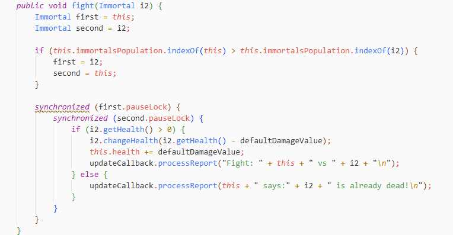
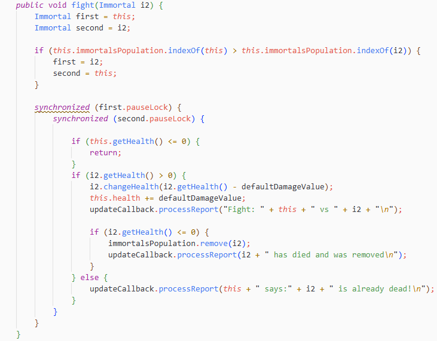

## Escuela Colombiana de Ingeniería
### Arquitecturas de Software – ARSW


#### Ejercicio – programación concurrente, condiciones de carrera y sincronización de hilos. EJERCICIO INDIVIDUAL O EN PAREJAS.

##Juan Pablo Vega - Sebastian Aurela Medina

##### **Parte I – Antes de terminar la clase.**

Control de hilos con wait/notify. Productor/consumidor.

1. Revise el funcionamiento del programa y ejecútelo. Mientras esto ocurren, ejecute jVisualVM y revise el consumo de CPU del proceso correspondiente. A qué se debe este consumo?, cual es la clase responsable?

Encotramos que al ejecutar el programa original (Producer agregando un número cada segundo y Consumer sacando elementos) y revisarlo en jVisualVM, el consumo de CPU se mantenía alto todo el tiempo, alrededor de un 13%, incluso cuando la cola estaba vacía y no había nada que consumir.

Esto se debia a que el problema estaba en la clase Consumer. Su método run() tenía un ciclo while(true) que preguntaba constantemente "¿hay algo en la cola?" (queue.size() > 0), sin detenerse nunca a esperar. Cuando la cola estaba vacía (que era casi todo el tiempo, porque el productor tardaba un segundo en agregar cada elemento), el hilo seguía preguntando lo mismo miles de veces por segundo sin descanso. Esto se conoce como "Espera activa", que es cuando el hilo mantiene al procesador ocupado haciendo un trabajo que en realidad no sirve de nada.

La clase responsable fue Consumer, especificamente su metodo run ().
Esto se confirmó en jVisualVM porque en la pestaña de Threads, el hilo del Consumer (Thread-1) aparecía todo el tiempo en estado "Running", mientras que el Producer (Thread-0) pasaba la mayor parte del tiempo dormido y casi no aportaba al consumo de CPU.


2. Haga los ajustes necesarios para que la solución use más eficientemente la CPU, teniendo en cuenta que -por ahora- la producción es lenta y el consumo es rápido. Verifique con JVisualVM que el consumo de CPU se reduzca.


Modificamos la forma en que el Consumer espera por elementos. En vez de preguntar todo el tiempo si hay algo en la cola, ahora usa wait(): si la cola está vacía, el hilo se queda "dormido" sin gastar CPU, y solo se despierta cuando el Producer le avisa con notifyAll() que acaba de agregar algo. Para que esto funcione, ambas clases (Producer y Consumer) tuvieron que sincronizarse usando la propia cola como punto de control compartido (bloque synchronized), ya que en Java solo se puede usar wait() y notify() dentro de una sección sincronizada.

En resumen: antes el consumidor preguntaba sin parar; ahora se queda quieto esperando una señal, y solo se activa cuando realmente hay trabajo por hacer.

Se verifico en VisualVM, el consumo de CPU bajó de ~13% a un rango entre 0.0% y 0.5%, y en la pestaña de Threads ambos hilos aparecían la mayor parte del tiempo en estado "Wait" en lugar de "Running", confirmando que ya no había espera activa.


3. Haga que ahora el productor produzca muy rápido, y el consumidor consuma lento. Teniendo en cuenta que el productor conoce un límite de Stock (cuantos elementos debería tener, a lo sumo en la cola), haga que dicho límite se respete. Revise el API de la colección usada como cola para ver cómo garantizar que dicho límite no se supere. Verifique que, al poner un límite pequeño para el 'stock', no haya consumo alto de CPU ni errores.

Aca lo que hicimos que se se invirtieron las velocidades: ahora el Producer genera elementos muy rápido (sin pausas) y el Consumer los procesa lento (con una espera de 1 segundo entre cada uno). Como el productor es mucho más rápido, si no se controla nada la cola crecería sin límite. Para evitarlo, se usó el valor de stockLimit que ya existía en la clase Producer pero que antes no se aplicaba: se agregó una condición para que, si la cola ya alcanzó ese límite (por ejemplo, 5 elementos), el Producer se detenga usando wait() hasta que el Consumer saque algo y le avise con notifyAll() que ya hay espacio libre otra vez.
De esta forma, el productor nunca sobrepasa el límite de stock definido, y tampoco se queda "preguntando sin parar" si ya hay espacio: se bloquea de forma eficiente y se despierta solo cuando corresponde.

Verificamos en VisualVM, incluso con un límite de stock pequeño (5 elementos), el consumo de CPU se mantuvo bajo, con pequeños aumentos puntuales (hasta 1.1%) que corresponden a los momentos en que el productor llena rápidamente el espacio disponible, y luego vuelve a quedar en espera


##### **Parte II. – Antes de terminar la clase.**

Teniendo en cuenta los conceptos vistos de condición de carrera y sincronización, haga una nueva versión -más eficiente- del ejercicio anterior (el buscador de listas negras). En la versión actual, cada hilo se encarga de revisar el host en la totalidad del subconjunto de servidores que le corresponde, de manera que en conjunto se están explorando la totalidad de servidores. Teniendo esto en cuenta, haga que:

- La búsqueda distribuida se detenga (deje de buscar en las listas negras restantes) y retorne la respuesta apenas, en su conjunto, los hilos hayan detectado el número de ocurrencias requerido que determina si un host es confiable o no (_BLACK_LIST_ALARM_COUNT_).
- Lo anterior, garantizando que no se den condiciones de carrera.

## Problema inicial

La versión concurrente inicial dividía los 80.000 servidores de listas negras entre varios hilos. Sin embargo, cada hilo revisaba por completo el rango que tenía asignado, aun cuando entre todos ya se hubieran encontrado las 5 ocurrencias requeridas por **BLACK_LIST_ALARM_COUNT**.

Esto era ineficiente porque, una vez se alcanzan 5 coincidencias, el host ya debe clasificarse como no confiable y no es necesario consultar las listas restantes.

Además, un contador o una lista compartidos no podían ser modificados directamente por varios hilos al mismo tiempo, porque esto podía causar una condición de carrera: dos hilos podían intentar actualizar el estado simultáneamente y perder resultados o dejar un conteo incorrecto.

## Solución implementada

Se creó la clase **SharedBlackListsState**, compartida por todos los hilos de búsqueda. Esta clase almacena las coincidencias encontradas y el límite de alarma.

Los métodos que agregan una coincidencia, verifican si se alcanzó el límite y entregan el resultado se declararon con **synchronized**. Así, solo un hilo puede modificar o consultar el estado compartido a la vez, evitando condiciones de carrera.

Cada **BlackListSearchThread** revisa su segmento de servidores, pero antes de cada nueva consulta verifica si ya se alcanzó la cantidad máxima de ocurrencias. Cuando cualquier hilo encuentra la quinta coincidencia, los demás hilos detectan que la alarma ya fue alcanzada y terminan su búsqueda sin revisar las listas restantes.

## Resultados de la prueba

Se probó la IP **202.24.34.55**, la cual aparece en las listas negras con índices:

**[29, 10034, 20200, 31000, 70500]**

Como se encontraron las 5 coincidencias requeridas, el sistema reportó correctamente el host como **NOT trustworthy**.

| Número de hilos | Tiempo de ejecución | Coincidencias encontradas |
|---:|---:|---|
| 1 | 108928 ms | 5 |
| 8 | 1449 ms | 5 |
| 16 | 1546 ms | 5 |
| 50 | 1609 ms | 5 |
| 100 | 979 ms | 5 |

Los resultados muestran una mejora importante frente a la ejecución con un solo hilo. Con 1 hilo, la búsqueda tardó aproximadamente 109 segundos; con 8 hilos, tardó aproximadamente 1.4 segundos.

El mejor resultado de esta prueba fue con 100 hilos, con 979 ms. Sin embargo, más hilos no siempre garantizan una reducción proporcional del tiempo: crear y coordinar demasiados hilos también tiene un costo, y el sistema operativo debe repartir el procesador entre ellos.

## Conclusión

La solución detecta correctamente cuándo un host aparece en al menos cinco listas negras y lo reporta como no confiable. Además, utiliza sincronización para proteger el contador y la lista de resultados compartidos, y permite que la búsqueda se detenga anticipadamente cuando ya se obtuvo la respuesta necesaria.


##### Parte III. – Avance para el martes, antes de clase.

Sincronización y Dead-Locks.


1. **Revise el programa “highlander-simulator”, dispuesto en el paquete edu.eci.arsw.highlandersim. Este es un juego en el que:**

	* Se tienen N jugadores inmortales.
	* Cada jugador conoce a los N-1 jugador restantes.
	* Cada jugador, permanentemente, ataca a algún otro inmortal. El que primero ataca le resta M puntos de vida a su contrincante, y aumenta en esta misma cantidad sus propios puntos de vida.
	* El juego podría nunca tener un único ganador. Lo más probable es que al final sólo queden dos, peleando indefinidamente quitando y sumando puntos de vida.

2. **Revise el código e identifique cómo se implemento la funcionalidad antes indicada. Dada la intención del juego, un invariante debería ser que la sumatoria de los puntos de vida de todos los jugadores siempre sea el mismo(claro está, en un instante de tiempo en el que no esté en proceso una operación de incremento/reducción de tiempo). Para este caso, para N jugadores, cual debería ser este valor?.**

El programa implementa N hilos (uno por inmortal), donde cada hilo ejecuta indefinidamente un bucle que: (1) selecciona aleatoriamente a otro inmortal de una lista compartida, (2) lo ataca reduciendo su vida en un valor fijo y aumentando la propia en esa misma cantidad, y (3) espera 1 ms antes de repetir. No hay mecanismos de sincronización, por lo que múltiples hilos acceden concurrentemente a la lista de inmortales y a sus valores de vida.

Dado que cada ataque transfiere puntos de vida de un inmortal a otro sin crear ni destruir vida, el invariante del sistema es que la suma total de puntos de vida de todos los inmortales debe permanecer constante. Para N jugadores que inician con 100 puntos de vida cada uno, este valor es N × 100. Por ejemplo, con 3 inmortales la suma siempre debería ser 300.


**3.Ejecute la aplicación y verifique cómo funcionan las opción ‘pause and check’. Se cumple el invariante?.**

Al ejecutar la aplicación y presionar repetidamente el botón "Pause and check", se observa que el invariante NO se cumple de manera consistente. Aunque teóricamente la suma debería ser siempre 300 (para 3 inmortales), en la práctica se ven valores como 340, 440, 500, etc.


Esto ocurre por dos razones:

**El botón no pausa los hilos**: mientras el hilo principal lee la lista y suma los valores, los otros hilos siguen atacando y modificando concurrentemente los valores de vida.

**Alta frecuencia de ataques**: el bucle while(true) con sleep(1) hace que los inmortales peleen aproximadamente cada 1-2 ms, por lo que es muy probable que ocurran modificaciones durante la lectura.

El invariante solo se verificaría correctamente si los hilos se pausaran realmente antes de leer los valores.


**4. Una primera hipótesis para que se presente la condición de carrera para dicha función (pause and check), es que el programa consulta la lista cuyos valores va a imprimir, a la vez que otros hilos modifican sus valores. Para corregir esto, haga lo que sea necesario para que efectivamente, antes de imprimir los resultados actuales, se pausen todos los demás hilos. Adicionalmente, implemente la opción ‘resume’.**

Para corregir la condición de carrera del botón "Pause and check", se agregó a la clase Immortal un indicador booleano paused, protegido por un objeto de bloqueo dedicado pauseLock. Dentro del método run(), al inicio de cada iteración del bucle, cada hilo verifica este indicador dentro de un bloque synchronized(pauseLock); si está en true, el hilo se bloquea invocando pauseLock.wait(), liberando el lock mientras espera. El botón "Pause and check" invoca el método pause() sobre todos los inmortales (que fija paused = true) antes de recorrer la lista y sumar los valores de vida. El botón "Resume" invoca resumeImmortal(), que fija paused = false y llama a pauseLock.notifyAll() para despertar a todos los hilos en espera. De esta forma, ningún hilo puede modificar los valores de vida mientras se están leyendo para el cálculo de la suma.


**5. Verifique nuevamente el funcionamiento (haga clic muchas veces en el botón). Se cumple o no el invariante?.**

El invariante menciona que debe ser constante, si N=3, entonces deberiamos ver en todas las pausas 300:



Como podemos observar, efectivamente si se cumple el invariante. 

**6. Identifique posibles regiones críticas en lo que respecta a la pelea de los inmortales. Implemente una estrategia de bloqueo que evite las condiciones de carrera. Recuerde que si usted requiere usar dos o más ‘locks’ simultáneamente, puede usar bloques sincronizados anidados:**

	```java
	synchronized(locka){
		synchronized(lockb){
			…
		}
	}
	```
La región crítica identificada es el método fight(): en él se lee la vida de la víctima, se le resta el daño y esa misma cantidad se suma a la vida del atacante. Si dos hilos ejecutan fight() involucrando a un mismo inmortal al mismo tiempo (por ejemplo, dos inmortales atacándose mutuamente, o dos atacando a un tercero simultáneamente), las lecturas y escrituras sobre health pueden entrelazarse y romper el invariante de la suma total.

Para proteger esta región se usa el pauseLock de cada inmortal como lock de sincronización de la pelea, tomando los locks de ambos participantes de forma anidada (synchronized(first.pauseLock){ synchronized(second.pauseLock){ ... } }). El punto clave de la estrategia es el orden en que se adquieren esos locks: en vez de bloquear siempre primero al atacante y luego a la víctima (lo que puede generar un deadlock si dos hilos se atacan entre sí al mismo tiempo, cada uno esperando el lock que tiene el otro), se determina el orden según la posición de cada inmortal en la lista compartida immortalsPopulation (indexOf), bloqueando siempre primero al de menor índice. De esta manera, cualquier par de hilos que intenten pelear entre sí adquieren los locks en el mismo orden global, eliminando la posibilidad de espera circular (deadlock)


**7. Tras implementar su estrategia, ponga a correr su programa, y ponga atención a si éste se llega a detener. Si es así, use los programas jps y jstack para identificar por qué el programa se detuvo.**

Tras implementar la estrategia de bloqueo con locks anidados y ordenados por índice, se dejó el programa corriendo durante aproximadamente 2 minutos con varios inmortales atacándose continuamente. En ningún momento el programa se detuvo ni dejó de responder: los mensajes de "Fight: ..." se siguieron imprimiendo de forma constante en el área de texto, y los botones de la interfaz (incluyendo "Pause and check") siguieron funcionando con normalidad durante toda la prueba.

Esto confirma que la estrategia de ordenar la adquisición de los locks por la posición de cada inmortal en la lista compartida (en vez de tomarlos en el orden "atacante, luego víctima") efectivamente evita el deadlock: dado que todos los hilos adquieren los locks siempre en el mismo orden global, no es posible que se forme una espera circular entre dos hilos que se atacan mutuamente, que es la condición necesaria para que ocurra un deadlock. Como no se presentó un bloqueo, no fue necesario usar jps/jstack para diagnóstico en este caso.


**8. Plantee una estrategia para corregir el problema antes identificado (puede revisar de nuevo las páginas 206 y 207 de _Java Concurrency in Practice_).**

La estrategia aplicada corresponde a la solución de lock ordering descrita en las páginas 130 de Java Concurrency in Practice: cuando una operación necesita tomar dos locks a la vez (como ocurre en fight(), que involucra al atacante y a la víctima), el riesgo de deadlock aparece si distintos hilos pueden adquirir esos dos locks en órdenes opuestos. La solución consiste en inducir un orden total y consistente sobre los locks, de modo que todos los hilos los adquieran siempre en la misma secuencia, independientemente de cuál sea el "origen" y cuál el "destino" de la operación.

JCIP resuelve esto usando System.identityHashCode() como criterio de orden cuando los objetos no tienen uno natural. En este caso se usó como criterio la posición de cada inmortal en la lista compartida immortalsPopulation (obtenida con indexOf): en fight(), antes de tomar los locks se compara el índice de this y de i2, y siempre se bloquea primero el pauseLock del inmortal con menor índice. De esta forma, dos hilos que se atacan mutuamente —el caso que generaría espera circular— siempre intentan adquirir los locks en el mismo orden, por lo que nunca terminan bloqueados esperando el uno al otro. Esto es consistente con lo observado en el punto 7: el programa corrió sin detenerse en ningún momento.


**9. Una vez corregido el problema, rectifique que el programa siga funcionando de manera consistente cuando se ejecutan 100, 1000 o 10000 inmortales. Si en estos casos grandes se empieza a incumplir de nuevo el invariante, debe analizar lo realizado en el paso 4.**

Se ejecutó la simulación con 100, 1000 y 10000 inmortales, verificando en cada caso el invariante mediante el botón "Pause and check" repetidas veces. En los tres casos el invariante se mantuvo correctamente: la suma total de puntos de vida fue siempre N×100 (por ejemplo, 1.000.000 para 10000 inmortales), sin importar cuántas veces se consultara.

Sí se notó un impacto claro en el rendimiento a medida que aumenta N: con 10000 inmortales la simulación se volvió notablemente más lenta y demandante para la máquina. Esto es consistente con el diseño actual de fight(), que llama dos veces a immortalsPopulation.indexOf(...) en cada pelea (una para saber la posición propia y otra, dentro de la comparación de orden, para la del oponente) sobre una LinkedList, cuya operación indexOf es O(n). Con miles de inmortales ejecutándose concurrentemente, cada uno haciendo esta búsqueda lineal en cada iteración de su bucle, el costo total crece rápidamente. Aun así, la corrección del invariante no se ve afectada — el impacto es únicamente de rendimiento, no de consistencia.


* Esto fue lo que obtuvimos para 100




* Para 1000, esto llevaba a mi cpu a casi un 50%, lo verificamos con el programa de VisualVM





Para 10000, este fue el que mas le costo, supero 50% en el uso de cpu.


**10. Un elemento molesto para la simulación es que en cierto punto de la misma hay pocos 'inmortales' vivos realizando peleas fallidas con 'inmortales' ya muertos. Es necesario ir suprimiendo los inmortales muertos de la simulación a medida que van muriendo. Para esto:
	* Analizando el esquema de funcionamiento de la simulación, esto podría crear una condición de carrera? Implemente la funcionalidad, ejecute la simulación y observe qué problema se presenta cuando hay muchos 'inmortales' en la misma. Escriba sus conclusiones al respecto en el archivo RESPUESTAS.txt.
	* Corrija el problema anterior __SIN hacer uso de sincronización__, pues volver secuencial el acceso a la lista compartida de inmortales haría extremadamente lenta la simulación.**

Este era la imagen de como teniamos el metodo Fight antes de el cambio, vamos a realiazr un codigo implementando la funcionalidad que se menciona en esta pregunta para observar que problema se presenta.
 
 
Imange de como quedo el codigo ahora.
 

Al ejecutar esto, obtuvimos esto:


El programa se detuvo solo depues de un momento, ya que como cuando un Inmortal tenia cero vida era eliminado definitivamente.
Entonces Sí, eliminar inmortales de la lista compartida mientras la simulación corre introduce una condición de carrera. La lista immortalsPopulation (un LinkedList) no tiene ningún mecanismo de sincronización que proteja su estructura: mientras un hilo ejecuta remove(i2) al detectar que un inmortal murió, decenas de otros hilos están simultáneamente llamando size(), get(indice) e indexOf(...) sobre esa misma lista, tanto para elegir oponente en run() como para el ordenamiento de locks en fight().

Al implementar esta funcionalidad y ejecutar la simulación con un número considerable de inmortales, se observó que, tras dejarla correr un momento, la simulación se detuvo por completo con la lista de inmortales completamente vacía (suma de vida en 0, sin ningún inmortal restante). Esto no corresponde al comportamiento esperado del juego: dado que la vida total se conserva en cada pelea, en el peor de los casos debería quedar siempre al menos un inmortal con la totalidad de los puntos de vida acumulados. Que la lista termine vacía indica que la modificación concurrente y no sincronizada de la estructura del LinkedList (remociones ocurriendo al mismo tiempo que otros hilos la recorren) corrompe su estado interno, provocando que se pierdan o eliminen inmortales de forma incorrecta.

**Análisis y observación del problema**: Eliminar inmortales de la lista compartida mientras la simulación corre introduce condiciones de carrera, ya que immortalsPopulation no tenía ningún mecanismo de protección mientras múltiples hilos la recorrían (get, indexOf, size) y la modificaban (remove) de forma simultánea. Al implementar una primera versión de la eliminación sobre un LinkedList sin sincronización, la simulación terminaba con la lista completamente vacía (suma de vida en 0) tras dejarla correr un momento — un resultado imposible según la lógica del juego, ya que la vida nunca se crea ni se destruye, solo se transfiere; en el peor caso debería sobrevivir siempre al menos un inmortal con toda la vida acumulada.

Corrección sin sincronización adicional: Se identificaron y corrigieron tres causas relacionadas, ninguna resuelta con locks nuevos:

Se reemplazó la lista compartida de LinkedList a CopyOnWriteArrayList, una colección de java.util.concurrent pensada para escenarios de muchas lecturas concurrentes y pocas escrituras (como este caso), que evita la corrupción estructural de la lista sin que el código cliente tenga que sincronizar el acceso.
Se agregó una verificación en run(): cada hilo revisa su propia salud al inicio de cada iteración y termina su ejecución (break) si ya es <= 0, evitando que inmortales ya eliminados de la lista sigan generando ataques como hilos "zombie".
Se detectó una condición de carrera adicional: entre el momento en que un hilo comprobaba su propia salud y el momento en que efectivamente atacaba, otro hilo podía matarlo y eliminarlo de la lista — pero al ejecutar igual su ataque, la línea this.health += defaultDamageValue lo "revivía" con salud positiva sin que ya estuviera en la lista, generando hilos zombie invisibles que seguían atacando indefinidamente. Se corrigió repitiendo la verificación de la propia salud, esta vez dentro del bloque sincronizado sobre los pauseLock (el único punto donde el valor leído es confiable), evitando el ataque si el inmortal ya fue eliminado por otro hilo.

Tras estos tres cambios, la simulación se estabiliza correctamente: converge siempre a un único sobreviviente con la totalidad de la vida acumulada (por ejemplo, 300 para 3 inmortales iniciales), cumpliendo el invariante sin necesidad de sincronizar el acceso a la lista compartida.


**11. Para finalizar, implemente la opción STOP.**

Se agregó a Immortal un indicador volatile boolean running, revisado tanto en la condición del bucle principal (while(running)) como dentro de la espera por pausa (while(paused && running)), y un método stopImmortal() que lo pone en false y ejecuta pauseLock.notifyAll() para despertar al hilo en caso de que estuviera pausado esperando en wait(). El botón "STOP" invoca stopImmortal() sobre todos los inmortales, terminando su ejecución de forma ordenada sin importar en qué estado se encontraran (peleando, dormidos o pausados).


<!--
### Criterios de evaluación

1. Parte I.
	* Funcional: La simulación de producción/consumidor se ejecuta eficientemente (sin esperas activas).

2. Parte II. (Retomando el laboratorio 1)
	* Se modificó el ejercicio anterior para que los hilos llevaran conjuntamente (compartido) el número de ocurrencias encontradas, y se finalizaran y retornaran el valor en cuanto dicho número de ocurrencias fuera el esperado.
	* Se garantiza que no se den condiciones de carrera modificando el acceso concurrente al valor compartido (número de ocurrencias).


2. Parte III.
	* Diseño:
		- Coordinación de hilos:
			* Para pausar la pelea, se debe lograr que el hilo principal induzca a los otros a que se suspendan a sí mismos. Se debe también tener en cuenta que sólo se debe mostrar la sumatoria de los puntos de vida cuando se asegure que todos los hilos han sido suspendidos.
			* Si para lo anterior se recorre a todo el conjunto de hilos para ver su estado, se evalúa como R, por ser muy ineficiente.
			* Si para lo anterior los hilos manipulan un contador concurrentemente, pero lo hacen sin tener en cuenta que el incremento de un contador no es una operación atómica -es decir, que puede causar una condición de carrera- , se evalúa como R. En este caso se debería sincronizar el acceso, o usar tipos atómicos como AtomicInteger).

		- Consistencia ante la concurrencia
			* Para garantizar la consistencia en la pelea entre dos inmortales, se debe sincronizar el acceso a cualquier otra pelea que involucre a uno, al otro, o a los dos simultáneamente:
			* En los bloques anidados de sincronización requeridos para lo anterior, se debe garantizar que si los mismos locks son usados en dos peleas simultánemante, éstos será usados en el mismo orden para evitar deadlocks.
			* En caso de sincronizar el acceso a la pelea con un LOCK común, se evaluará como M, pues esto hace secuencial todas las peleas.
			* La lista de inmortales debe reducirse en la medida que éstos mueran, pero esta operación debe realizarse SIN sincronización, sino haciendo uso de una colección concurrente (no bloqueante).

	

	* Funcionalidad:
		* Se cumple con el invariante al usar la aplicación con 10, 100 o 1000 hilos.
		* La aplicación puede reanudar y finalizar(stop) su ejecución.
		
		-->

<a rel="license" href="http://creativecommons.org/licenses/by-nc/4.0/"></a><br />Este contenido hace parte del curso Arquitecturas de Software del programa de Ingeniería de Sistemas de la Escuela Colombiana de Ingeniería, y está licenciado como <a rel="license" href="http://creativecommons.org/licenses/by-nc/4.0/">Creative Commons Attribution-NonCommercial 4.0 International License</a>.
